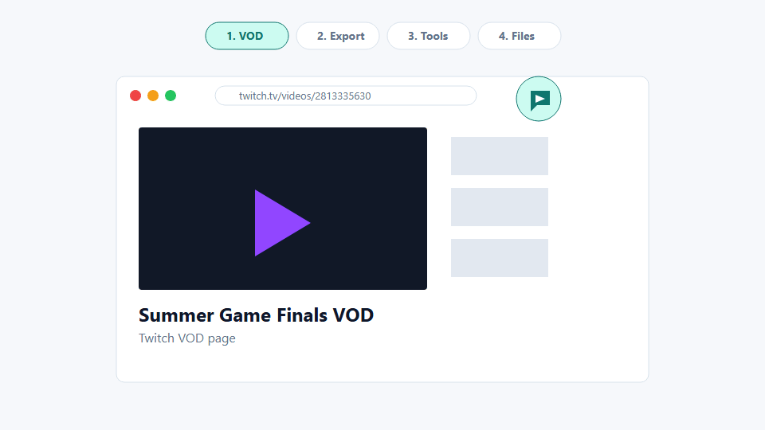
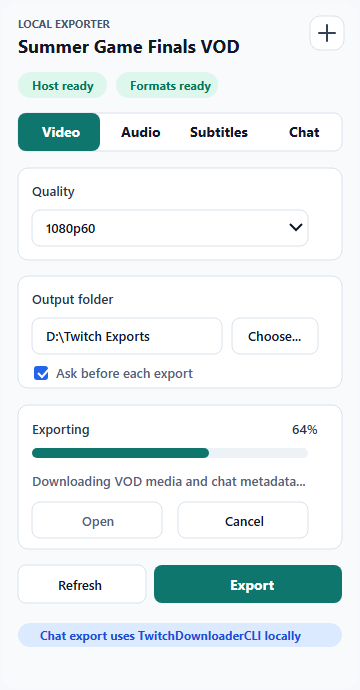
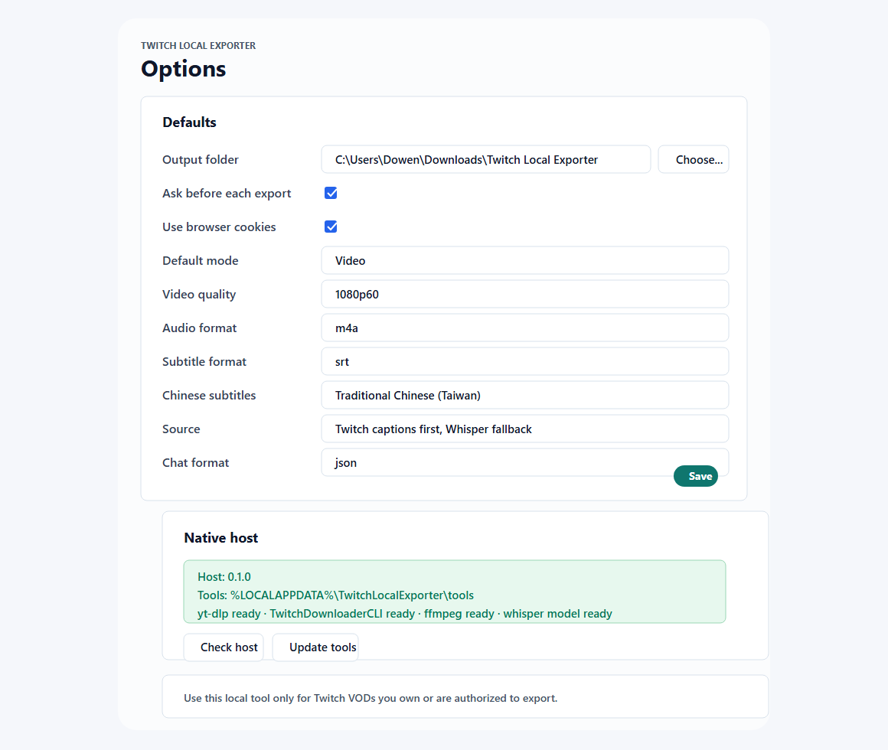
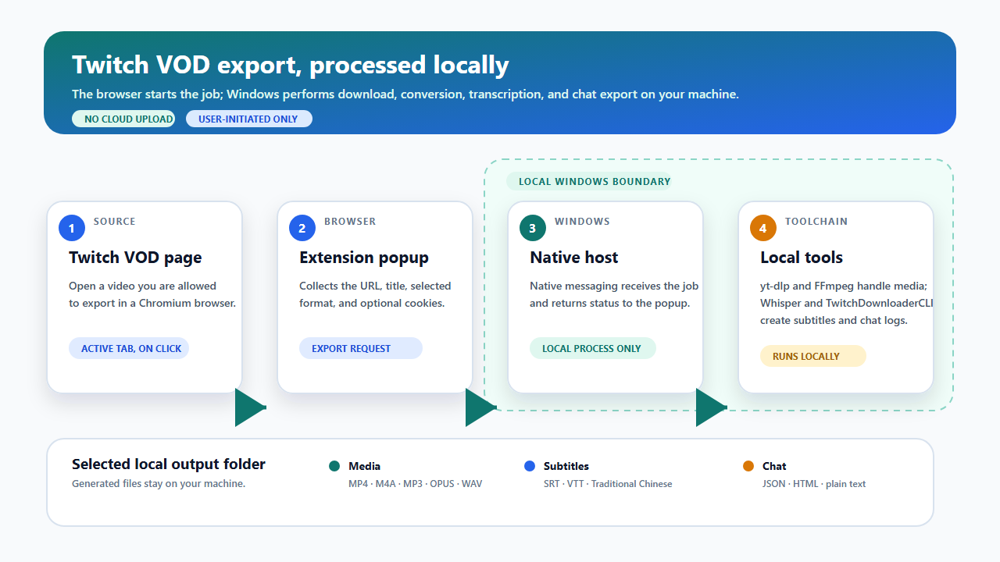

# Twitch Local Exporter

> This extension is maintained in the [Local Exporters monorepo](../../README.md). The official site is <https://www.dowen.idv.tw/local_exporters/>.

[](https://github.com/Tokenyet/local_exporters/actions/workflows/ci.yml)
[](https://github.com/Tokenyet/local_exporters/releases)
[](LICENSE)

Turn the current Twitch VOD tab into a local export pipeline.

Twitch Local Exporter is a Windows and macOS Chromium extension that exports video, audio, captions, and VOD chat from the current Twitch VOD page to local files. It runs `yt-dlp`, FFmpeg, optional Whisper transcription, and TwitchDownloaderCLI through a local native host, so you do not have to copy URLs or remember one-off terminal commands.

No cloud transcription. No analytics. Generated media and chat logs stay on your machine.



## Why I Built It

I often follow chat-focused Twitch streamers, but sometimes I do not have time to watch live. I wanted a practical way to learn what had been discussed without scrubbing through an entire VOD first. Exported subtitles and optional VOD chat provide enough source material to build an outline, search for topics, or use a separate AI summarizer.

The extension prepares local files only; it does not upload the VOD or transcript to an AI provider.

## Why Use It

- Export the current Twitch VOD tab instead of pasting URLs into a terminal.
- Reuse your signed-in browser session when `yt-dlp` can use Twitch cookies.
- Save MP4 video, audio-only files, SRT/VTT subtitles, or VOD chat logs.
- Prefer Twitch-provided caption tracks when exposed by the downloader, and fall back to local Whisper transcription when no track is available.
- Convert Chinese subtitle output to Traditional Chinese (Taiwan) with OpenCC when requested.
- Export VOD chat as JSON, HTML, or plain text through TwitchDownloaderCLI.

## Quick Start

1. Download the platform bundle from Releases: `...-windows.zip` on Windows or `...-macos-arm64.zip` / `...-macos-x64.zip` on macOS.
2. Extract the ZIP.
3. Open `chrome://extensions`, `edge://extensions`, or your Chromium browser's extensions page.
4. Enable `Developer mode`.
5. Choose `Load unpacked`.
6. Select the extracted `extension` folder.
7. Copy the generated extension ID.
8. Open PowerShell in the extracted release folder and run:

```powershell
.\scripts\install-native.ps1 -ExtensionId <extension-id> -Browser chrome
.\scripts\update-tools.ps1
```

Use `-Browser edge`, `-Browser chromium`, `-Browser vivaldi`, or omit `-Browser` to register all supported browser registry paths.

On macOS, run the shell installer from the extracted release bundle instead:

```bash
./scripts/install-native.sh --extension-id <extension-id> --browser chrome
./scripts/update-tools.sh
```

Use `--browser edge`, `--browser chromium`, `--browser vivaldi`, or `--browser all`. The installer registers native messaging manifests under `~/Library/Application Support`.

Open a Twitch VOD page like `https://www.twitch.tv/videos/<vod-id>`, click the extension icon, choose `Video`, `Audio`, `Subtitles`, or `Chat`, pick an output folder, then start the export.

## What It Exports

- MP4 video with a selected maximum quality.
- Audio as m4a, mp3, opus, wav, or best available.
- Subtitles as SRT or VTT.
- Local Whisper subtitles when Twitch captions are missing or when forced.
- Optional Chinese subtitle conversion from Simplified/mixed Chinese to Traditional Chinese (Taiwan).
- VOD chat as JSON, HTML, or text.

## Screenshots





## Technical Architecture



The flow is: **Twitch VOD tab → extension popup → local native host → local tools → selected output folder**. The Manifest V3 extension reads the active Twitch tab only when you open the popup; it sends the export request to a native messaging host, which runs the local toolchain and writes generated files to your selected output folder.

`TwitchDownloaderCLI` is used for chat export because its `chatdownload` mode supports VOD chat output as JSON, HTML, or text. Media and Whisper subtitle fallback use `yt-dlp`, FFmpeg, and whisper.cpp. Chinese subtitle conversion uses OpenCC `s2twp` after the subtitle file is produced, leaving VOD chat text unchanged.

## Release Downloads

- `twitch-local-exporter-vX.Y.Z-windows.zip`: complete Windows sideload bundle.
- `twitch-local-exporter-vX.Y.Z-macos-arm64.zip` / `twitch-local-exporter-vX.Y.Z-macos-x64.zip`: complete macOS sideload bundles.
- `twitch-local-exporter-extension-vX.Y.Z.zip`: extension-only runtime package for inspection or custom installation.
- `twitch-local-exporter-host-vX.Y.Z-windows-x64.exe` and the matching macOS host asset: optional standalone native host executables.
- `SHA256SUMS.txt`: checksums for release downloads.

## Requirements

- Windows 10 or 11, or macOS with an Intel or Apple Silicon processor.
- Chrome, Edge, Chromium, or Vivaldi.
- PowerShell on Windows, or a shell and Python 3.11+ on macOS.
- Python 3.11 or newer if you install from source without the release-built native host executable.
- `opencc-python-reimplemented`, installed automatically by the native installer for source-based Python host installs.

Subtitle export automatically prefers the NVIDIA CUDA/cuBLAS whisper.cpp binary when the toolchain was updated on a machine with `nvidia-smi`. If CUDA startup fails, the native host retries the same transcription with the CPU binary:

```powershell
.\scripts\update-tools.ps1 -WhisperAcceleration Auto
```

Use `-WhisperAcceleration Cpu` to force CPU-only installation, or `Cuda` to require the CUDA package.

For local VOD summaries, the exporter also supports an NVIDIA CUDA backend through faster-whisper. Install it into the selected local exporter toolchain and verify that CUDA is visible:

```powershell
.\\scripts\\install-gpu-whisper.ps1 -ToolchainMode Shared
```

Then run the summary exporter with the GPU backend:

```powershell
$GpuPython = Join-Path $env:LOCALAPPDATA "com.dowen.local_exporter\\toolchain\\runtimes\\faster-whisper\\Scripts\\python.exe"
& $GpuPython skills\\twitch-vod-summary\\scripts\\export_vod_summary.py `
  --whisper-backend faster-whisper --faster-whisper-device cuda `
  --faster-whisper-compute-type float16 --workers 1 `
  https://www.twitch.tv/videos/<vod-id>
```

The original whisper.cpp CPU backend remains available with the default options.

`update-tools.ps1` on Windows and `update-tools.sh` on macOS install common helper tools into the platform's shared toolchain directory:

- `yt-dlp`
- TwitchDownloaderCLI
- Deno for `yt-dlp` JavaScript runtime support
- FFmpeg and FFprobe
- whisper.cpp
- the selected Whisper model

The native installer supports three toolchain modes:

```powershell
.\scripts\install-native.ps1 -ExtensionId <extension-id> -ToolchainMode Shared
.\scripts\update-tools.ps1 -ToolchainMode Shared
```

Use `-ToolchainMode Isolated` to keep the legacy `%LOCALAPPDATA%\TwitchLocalExporter\tools` layout, or use `-ToolchainMode Custom -ToolchainRoot <path>` for another shared location. The selected mode is recorded in `%LOCALAPPDATA%\com.dowen.local_exporter\settings.json`; Twitch-only `TwitchDownloaderCLI` files are kept under the shared toolchain's `products\twitch` folder. Existing files are reused on later runs; add `-ForceUpdate` to `update-tools.ps1` when you explicitly want to redownload common tools.

Before downloading, the updater probes working CLI commands on `PATH` and reuses them when available. This applies to `yt-dlp`, Deno, FFmpeg/FFprobe, Whisper, and TwitchDownloaderCLI. Use `-ForceUpdate` to force bundled copies.

## Install From Source

```powershell
git clone https://github.com/Tokenyet/local_exporters.git
cd local_exporters\apps\twitch
.\scripts\package.ps1
```

Load this folder from your browser's extensions page:

```text
dist\unpacked\twitch-local-exporter
```

Copy the generated extension ID, then install the native messaging host:

```powershell
.\scripts\install-native.ps1 -ExtensionId <extension-id> -Browser chrome
.\scripts\update-tools.ps1
```

The source installer creates a `.cmd` launcher that runs the Python native host. To install a standalone executable instead:

```powershell
.\scripts\build-native.ps1
.\scripts\install-native.ps1 -ExtensionId <extension-id> -Browser chrome
```

When `native-host\dist\twitch-local-exporter-host.exe` exists, the installer copies and registers that executable.

On macOS, use the equivalent shell flow:

```bash
./scripts/package.sh
./scripts/install-native.sh --browser chrome
./scripts/update-tools.sh
```

If you build the standalone host first, run `./scripts/build-native.sh`; the installer will use `native-host/dist/twitch-local-exporter-host` when it is present. Without it, the installer creates an executable Python launcher and installs the Twitch subtitle conversion dependency locally.

## Privacy And Permissions

Media, subtitle, and chat export jobs are processed locally by the native host. The extension does not collect analytics, send generated media to a remote service, or use cloud transcription.

Permissions:

- `activeTab`: reads the current tab only when you open the extension popup.
- `nativeMessaging`: talks to the local native host that performs exports.
- `storage`: stores extension preferences such as default folder, export mode, formats, and subtitle settings.
- `cookies`: optionally provides Twitch cookies to local tools for VODs your browser session is allowed to access.
- Twitch host permissions: limited to Twitch VOD pages and Twitch cookies needed for signed-in exports.

See [docs/PRIVACY.md](docs/PRIVACY.md) for the short privacy note.

## Development

Run validation:

```powershell
node --check src\background.js
node --check src\content.js
node --check popup\popup.js
node --check options\options.js
node scripts\smoke-test.mjs
python -m unittest discover -s native-host\tests
```

Package the extension runtime:

```powershell
.\scripts\package.ps1
```

Package release assets locally:

```powershell
.\scripts\build-native.ps1
.\scripts\package-release.ps1 -Version 0.1.0
```

## Release Workflow

CI runs on pushes and pull requests. The release workflow runs when a tag like `v0.1.0` is pushed, or manually from GitHub Actions with a version input.

```powershell
git tag v0.1.0
git push origin v0.1.0
```

The workflow validates the extension, builds Windows and macOS native hosts, packages platform-specific release downloads, writes checksums, and publishes a GitHub Release with notes from [CHANGELOG.md](CHANGELOG.md).

## Scope

This project is built for local sideload use. It is not a Chrome Web Store release target in v0.1.0. It does not support batch jobs, DRM bypassing, paywall bypassing, or cloud transcription.

Use this tool only for Twitch VODs you own or are authorized to export.

## License

MIT. See [LICENSE](LICENSE).
